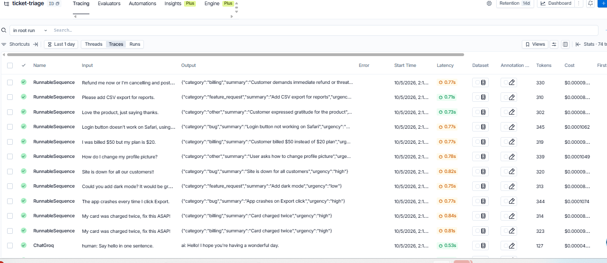

Support-email triage assistant built with LangChain and LangGraph: structured output, tool calling, and LangSmith tracing
# Support Ticket Triage with LangChain & LangGraph

An assistant that reads customer support emails and returns structured tickets
(category, urgency, summary), then routes them with tools and a LangGraph workflow.

## What it does
- Classifies emails into billing, bug, feature_request, or other
- Assigns urgency (low / medium / high)
- Returns validated structured output using Pydantic
- Traces every run with LangSmith

## Tech stack
Python, LangChain, LangGraph, Pydantic, Groq (gpt-oss-120b), LangSmith, Google Colab

## Project stages
| Stage | Notebook | Status |
|---|---|---|
| 1. Structured output chain | `notebooks/01_ticket_triage_chain.ipynb` | Done |
| 2. Tool calling | `notebooks/02_tools.ipynb` | In progress |
| 3. LangGraph workflow | `notebooks/03_langgraph_workflow.ipynb` | Planned |

## Example
Input: "Site is down for all our customers!!"
Output: `category='bug' urgency='high' summary='Site is down for all customers'`

## Run it yourself
1. Open the notebook in Google Colab
2. Add `GROQ_API_KEY` and `LANGSMITH_API_KEY` to Colab Secrets
3. Run the cells in order

## What I learned
Structured outputs, prompt design for classification, handling provider rate limits and
model changes, and tracing LLM calls with LangSmith.
